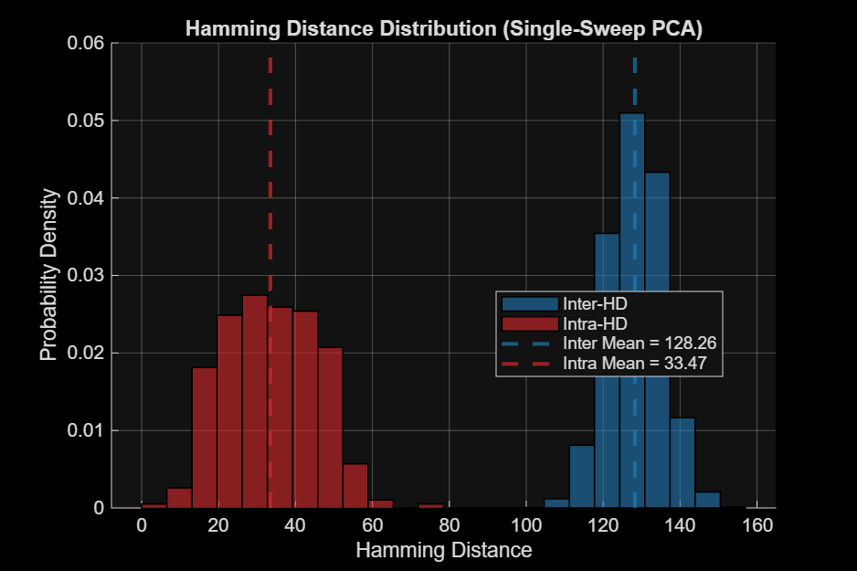

# Final Results Report

## What are intra vs inter Hamming graphs?
- **Intra-device distances**: Hamming distance between a regenerated ID (at authentication) and its *own* registered ID.
  These show how stable/reproducible each device's ID is over time.
- **Inter-device distances**: Hamming distances between a regenerated ID and *all other devices'* registered IDs.
  These show how well-separated the devices are (uniqueness).

Ideally: intra distances are low (close to 0), while inter distances are high (close to half the ID length).

## Single-sweep (5 -> 6)
- Devices registered: **300**
- Successfully authenticated: **85**
- Success rate: **28.33%**
- Mean intra Hamming: **33.47**

### Plots

## Multi-sweep (1..6 -> 7)
- Devices registered: **300**
- Successfully authenticated: **249**
- Success rate: **83.00%**
- Mean intra Hamming: **16.76**

### Plots

